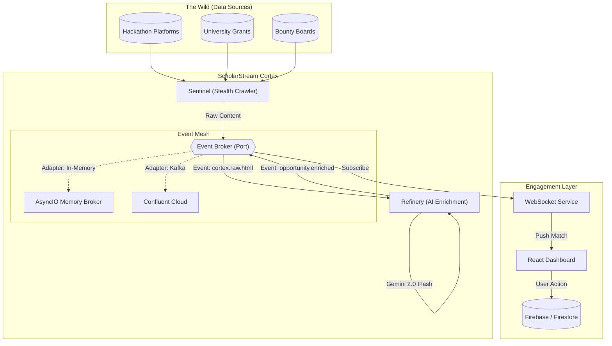

# 🎓 ScholarStream — Intelligence on Data in Motion

<p align="center">
  
  
  
  
</p>

> **ScholarStream is not just a database. It is a real-time, event-driven financial opportunity engine.**

Every year, **$2.9 billion** in scholarships goes unclaimed. This isn't a problem of qualification, but of **information asymmetry**. ScholarStream bridges this gap by treating discovery and matching as a real-time streaming problem, ensuring students never miss a life-changing opportunity.

---

## ⚡ High-Level Architecture

ScholarStream leverages a **Ports & Adapters (Hexagonal)** architecture to decouple core logic from infrastructure. This enables a **Zero-Dependency** local development experience while maintaining production-readiness.



---

## ✨ Core Pillars

### 1. The Pulse (Real-time Dashboard)
A WebSocket-powered central hub where opportunities appear the millisecond they are discovered. No refreshing, no delays. Once the AI finds a potential match, it's immediately etched into your profile.

### 2. The Trustee (Context-Aware AI Assistant)
Beyond a chatbot, the Trustee is a researcher. It uses **Gemini 2.0 Flash** and semantic similarity search to prioritize immediate bounties, emergency grants, and book stipends based on your natural language queries.

### 3. The Co-Pilot (Chrome Executioner)
A browser-native assistant that lives where applications happen. It reads the DOM, respects field constraints, and crafts tailored responses by referencing your uploaded resumes and project portfolios.

---

## 🏗️ Technical Deep Dive

- **Event-Driven Core**: **Ports & Adapters Architecture**. The system runs on an `EventBroker` abstraction.
    - *Local Mode*: Uses `MemoryBroker` (AsyncIO) for blazing fast, setup-free development.
    - *Production Mode*: Can swap to Kafka/Redpanda via simple config config.
- **AI/ML Engine**: [Google Vertex AI](https://cloud.google.com/vertex-ai) (Gemini 2.0 Flash) for schema extraction and semantic reasoning.
- **Backend Infrastructure**: [FastAPI](https://fastapi.tiangolo.com/) (Python 3.11+) with generic Event Mesh injection.
- **Frontend Layer**: [React](https://react.dev/) + [TypeScript](https://www.typescriptlang.org/) + [Vite](https://vitejs.dev/) + [Tailwind CSS](https://tailwindcss.com/) for a premium, low-latency UI.
- **Persistence**: [Firebase](https://firebase.google.com/) for real-time state management and user authentication.
- **Discovery**: [Playwright Stealth](https://github.com/microsoft/playwright) fleet designed to bypass basic bot detection on major platforms.

---

## 🚀 Deployment & Development

### Local Prerequisites
- **Node.js**: v18.0.0+
- **Python**: v3.11+
- **Docker**: Optional (for containerized testing)

### Installation
```bash
# 1. Clone the Architecture
git clone https://github.com/Muhammadurasheed/scholarstream-monorepo.git
cd scholarstream-monorepo

# 2. Frontend Initialization
npm install
npm run dev

# 3. Backend Initialization
cd backend
python -m venv venv
source venv/bin/activate # or venv\Scripts\activate on Windows
pip install -r requirements.txt
python run.py
```

### 🏰 Scaling with Google Cloud
ScholarStream is built for serverless scale using **Google Cloud Run**. The Port & Adapter architecture allows seamless transition to production.

```bash
chmod +x deploy.sh
./deploy.sh
```

---

## 🤝 Contributing

We welcome contributions from the community! Whether it's a new crawler, a UI enhancement, or an optimization to the matching logic.

1.  **Fork** the repository.
2.  **Create** a feature branch: `git checkout -b feature/amazing-logic`.
3.  **Commit** your changes: `git commit -m 'feat: Add newIntigriti crawler'`.
4.  **Push** to the branch: `git push origin feature/amazing-logic`.
5.  **Open** a Pull Request.

---

## ⚖️ License

Distributed under the **MIT License**. See `LICENSE` for more information.

---

## 🙏 Acknowledgments

ScholarStream was born from the personal story of a student who missed their graduation due to tuition asymmetry. We build for every student who is one opportunity away from their dream.

**Allahu Musta'an. The opportunities exist. Now you'll find them.**

<p align="center">
  Built with ❤️ for the global student community.
</p>
