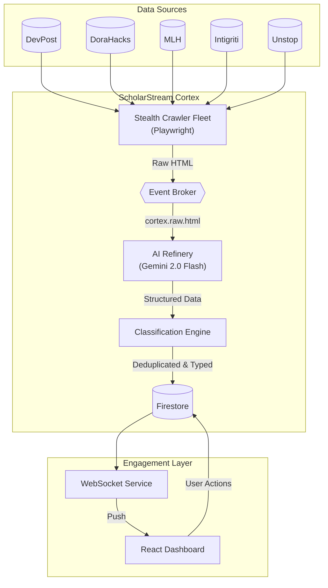

# 🎓 ScholarStream — Real-Time Financial Opportunity Engine

<p align="center">
  
  
  
  
  
  
  
</p>

> Every year, **$2.9 billion** in scholarships goes unclaimed. This isn't a problem of qualification — it's a problem of **information asymmetry**. ScholarStream eliminates that gap.

---

## 🧠 What Is ScholarStream?

ScholarStream is the world's first **real-time financial opportunity engine** for students. It combines **stealth web crawling**, **Google Cloud AI**, and a **semantic matching engine** to discover, enrich, and deliver personalized scholarships, hackathons, bounties, and grants — within seconds.

Unlike traditional scholarship databases where students search and scroll, ScholarStream **actively hunts** for opportunities and pushes them directly to the student's dashboard via WebSocket.

---

## ⚡ How It Works

```
User Profile → Semantic Vector (768-dim) → Stealth Crawlers Dispatch
                                                    ↓
                                          Raw HTML Discovery
                                                    ↓
                                    Gemini 2.0 Flash (AI Extraction)
                                                    ↓
                                      Structured Opportunity Data
                                                    ↓
                                   Real-Time Classification Engine
                                    ↓         ↓         ↓        ↓
                              Scholarship  Hackathon  Bounty   Grant
                                                    ↓
                                    WebSocket → Live Dashboard
```

**End-to-end latency: Under 5 seconds.**

---

## 🏗️ Architecture

ScholarStream uses a **Ports & Adapters (Hexagonal)** architecture with an event-driven core:


```mermaid
graph TD
    subgraph "Data Sources"
        W1[("DevPost")]
        W2[("DoraHacks")]
        W3[("MLH")]
        W4[("Intigriti")]
        W5[("Unstop")]
    end

    subgraph "ScholarStream Cortex"
        S1["Stealth Crawler Fleet<br/>(Playwright)"] --> |"Raw HTML"| EB{{"Event Broker"}}
        EB --> |"cortex.raw.html"| R1["AI Refinery<br/>(Gemini 2.0 Flash)"]
        R1 --> |"Structured Data"| CL["Classification Engine"]
        CL --> |"Deduplicated & Typed"| DB[("Firestore")]
    end

    subgraph "Engagement Layer"
        DB --> WS["WebSocket Service"]
        WS --> |"Push"| UI["React Dashboard"]
        UI --> |"User Actions"| DB
    end

    W1 --> S1
    W2 --> S1
    W3 --> S1
    W4 --> S1
    W5 --> S1
```

### Key Design Decisions

| Decision | Why |
|---|---|
| **Event Broker Abstraction** | Swap between in-memory (AsyncIO) for local dev and production message queues via config |
| **Stealth Crawlers** | Playwright with fingerprint spoofing to bypass bot detection on major platforms |
| **Semantic Vectors** | 768-dimensional embeddings (Vertex AI text-embedding-004) enable "passion matching" beyond keywords |
| **Hexagonal Architecture** | Zero-dependency local development while maintaining production-grade infrastructure |

---

## ✨ Core Features

### 1. 📡 The Pulse — Real-Time Dashboard
A WebSocket-powered hub where opportunities appear the instant they are discovered. No refreshing. Financial impact, priority alerts, and match scores update in real time.

### 2. 🧠 The Trustee — AI Research Assistant
A context-aware chat assistant powered by **Gemini 2.0 Flash**. It answers questions about opportunities, drafts application content, and even triggers on-demand crawls when the database is thin.

### 3. ✨ The Co-Pilot — Chrome Extension
A browser-native application assistant that lives where applications happen:
- **Unified Auth**: Log in once on the website, the extension authenticates automatically
- **Tri-Fold Knowledge Base**: Combines your profile, uploaded documents (@mentions), and field context
- **Sparkle Button**: Click ✨ on any form field to generate personalized, platform-calibrated content
- **Double-Click Refinement**: Instantly refine any generated content with follow-up instructions

### 4. 🎯 Semantic Matching Engine
Every student profile is vectorized into a 768-dimensional embedding. Every opportunity gets the same treatment. Match scores are computed via cosine similarity, enabling connections like:
> *"Petroleum Engineering student who codes in Python"* → *"Sustainability-focused Energy Hackathon"*

A match that keyword search would never find.

---

## 🛠️ Tech Stack

| Layer | Technologies |
|---|---|
| **Frontend** | React, TypeScript, Vite, Tailwind CSS, Shadcn/UI |
| **Backend** | Python 3.11+, FastAPI, AsyncIO, WebSocket |
| **AI/ML** | Google Vertex AI, Gemini 2.0 Flash, text-embedding-004 |
| **Database** | Firebase / Firestore (real-time sync) |
| **Discovery** | Playwright Stealth, BeautifulSoup |
| **Extension** | Chrome Extension (Manifest V3), React |
| **Infrastructure** | Google Cloud Run, Docker, Cloud Build |
| **Rate Limiting** | Upstash Redis |

---

## 🚀 Getting Started

### Prerequisites
- **Node.js** v18+
- **Python** 3.11+
- **Docker** (optional, for containerized deployment)

### Local Development

```bash
# 1. Clone
git clone https://github.com/Muhammadurasheed/scholarstream-monorepo.git
cd scholarstream-monorepo

# 2. Frontend
npm install
npm run dev

# 3. Backend
cd backend
python -m venv venv
source venv/bin/activate  # Windows: venv\Scripts\activate
pip install -r requirements.txt
python run.py

# 4. Extension (optional)
cd extension
npm install
npm run build
# Load extension/dist as unpacked extension in Chrome
```

### Production Deployment

ScholarStream deploys to **Google Cloud Run** with a single command:

```bash
chmod +x deploy.sh
./deploy.sh
```

This builds Docker containers for both frontend and backend, pushes them to Google Container Registry, and deploys to Cloud Run with environment secrets from `env.yaml`.

---

## 📁 Project Structure

```
scholarstream-monorepo/
├── src/                    # React frontend (Vite + TypeScript)
│   ├── components/         # UI components (dashboard, cards, widgets)
│   ├── pages/              # Route pages (Dashboard, Profile, Tracker)
│   ├── hooks/              # Custom React hooks
│   ├── services/           # Matching engine, API clients
│   └── utils/              # Utility functions
├── backend/                # FastAPI backend
│   ├── app/
│   │   ├── routes/         # API endpoints (extension, copilot, chat)
│   │   ├── services/       # Core services (AI, copilot, scrapers)
│   │   │   └── scrapers/   # Playwright stealth crawler fleet
│   │   └── database.py     # Firestore integration
│   └── run.py              # Entry point
├── extension/              # Chrome Extension (MV3)
│   ├── src/
│   │   ├── content/        # Content script (DOM scanner, Sparkle)
│   │   ├── sidepanel/      # Co-Pilot chat UI (React)
│   │   └── background/     # Service worker (proxy, auth)
│   └── dist/               # Production build
└── deploy.sh               # One-command Cloud Run deployment
```

---

## 🤝 Contributing

1. **Fork** the repository
2. **Create** a feature branch: `git checkout -b feature/new-crawler`
3. **Commit** your changes: `git commit -m 'feat: Add Unstop deep scraper'`
4. **Push** to the branch: `git push origin feature/new-crawler`
5. **Open** a Pull Request

---

## ⚖️ License

Distributed under the **MIT License**. See `LICENSE` for more information.

---

## 🙏 The Story

ScholarStream was born from the personal story of a student who missed their graduation due to tuition asymmetry. Every line of code is written with the memory of sitting at home since March 2025, watching opportunities pass by.

**This platform exists so that no student has to say: "I had to defer my education because I didn't know."**

Now they'll know. Now they'll find. Now they'll win.

<p align="center">
  Built with ❤️ for the global student community.
</p>
